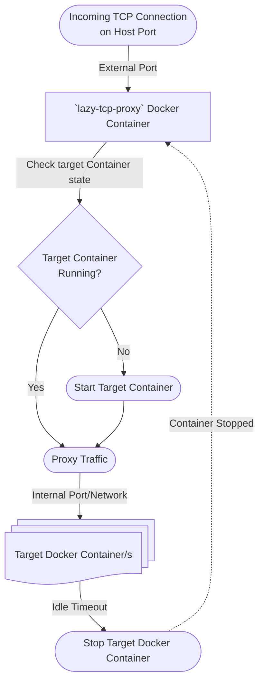

# lazy-tcp-proxy

# Overview

**On-demand TCP+UDP proxy for Docker containers.**

> 🥳 Now with UDP support! 🎉

## Introduction:

`lazy-tcp-proxy` allows you to run many Dockerized services on a single host, but only start containers when a connection arrives. It stops containers after a configurable idle timeout, saving resources while providing seamless access.

Supported architectures: `linux/amd64`, `linux/arm64`, `linux/arm/v7`

### Why:

To save compute resources (CPU, RAM, Electricity) on a single host by keeping containers stopped until they're actually needed, making it practical to run many low-traffic services without paying the cost of having them all running simultaneously.

### Feedback:

> "Finally, scale to zero!" - Nick G.

> "This is something that should really be built into Docker!" - Tom H.

---

## Quick Start

The quickest way to get started is to use the [docker-compose "recipes"](recipes).

These have many common services, with preconfigured options, so you can pick and choose.

(Don't forget to run [docker-compose.lazy-tcp-proxy.yml](recipes/docker-compose.lazy-tcp-proxy.yml))

Otherwise you can always run the container from the command line. You will need to add labels to your managed containers (see below).

```sh
docker run -d \
	-v /var/run/docker.sock:/var/run/docker.sock \
    -e IDLE_TIMEOUT_SECS=30 \
    -e POLL_INTERVAL_SECS=5 \
    -p "8080:8080" \
    -p "9000-9099:9000-9099" \
    --restart=always \
    --name lazy-tcp-proxy \
	mountainpass/lazy-tcp-proxy
```

---

## Container Label Configuration

Add `lazy-tcp-proxy` labels to any container you want proxied. At minimum:

```yaml
labels:
  - "lazy-tcp-proxy.enabled=true"
  - "lazy-tcp-proxy.ports=9000:80"
```

Full label reference, including UDP, allow/block lists, health checks, webhooks, cron scheduling, and dependency cascade:

**→ [README_LABELS.md](README_LABELS.md)**

---

## Dynamic Configuration File

If you can't add labels to a container (e.g. it already exists and can't be recreated), or you want centralised configuration, use the YAML config file instead. YAML config takes full precedence over labels when both are present.

Configure via environment variables:

| Variable | Default | Description |
|----------|---------|-------------|
| `CONFIG_PATH` | `/etc/lazy-tcp-proxy/config.yaml` | Path to the YAML config file |
| `ADMIN_PORT` | `0` | Admin API port (`0` = disabled) |
| `ADMIN_API_KEY` | *(required if `ADMIN_PORT` > 0)* | API key for the admin API (`GET /config`, `GET /config/reload`, `PUT /config/update`) |

**→ [README_CONFIG.md](README_CONFIG.md)**

---

## Environment Variables

| Variable              | Description                                                        | Default                   |
|-----------------------|--------------------------------------------------------------------|---------------------------|
| `IDLE_TIMEOUT_SECS`   | How long (in seconds) a container must be idle before being stopped. `0` = stop immediately once all connections close | 120  |
| `START_TIMEOUT_SECS`  | How long (in seconds) to wait for an upstream to be ready after a cold start — applies to the UDP datagram readiness probe, the HTTP health check (`lazy-tcp-proxy.http-healthcheck`), and the Docker HEALTHCHECK readiness gate. If the timeout is reached the connection/flow is dropped. Override per-container with the `lazy-tcp-proxy.start-timeout-secs` label | 30 |
| `POLL_INTERVAL_SECS`  | How often (in seconds) to check for idle containers                | 15                        |
| `DOCKER_SOCK`         | Path to Docker socket                                              | `/var/run/docker.sock`    |
| `WEB_PORT`            | Port for the HTTP web server (dashboard, `/metrics`, `/traefik`, `/health`); set to `0` to disable. `STATUS_PORT` is accepted as a legacy alias | 8080 |
| `WEB_HOST`            | When set, exposes lazy-tcp-proxy's web endpoint via Traefik: adds `Host('<WEB_HOST>') → http://<TRAEFIK_PROXY_HOST>:<WEB_PORT>` to `/traefik`. Unset = no Traefik route for the web endpoint | *(none)* |
| `STATUS_PORT`         | Legacy alias for `WEB_PORT`; ignored when `WEB_PORT` is set       | 8080                      |
| `CONFIG_PATH`         | Path to the dynamic YAML config file (see [README_CONFIG.md](README_CONFIG.md)) | `/etc/lazy-tcp-proxy/config.yaml` |
| `ADMIN_PORT`          | Port for the admin API; set to `0` to disable (see [README_CONFIG.md](README_CONFIG.md)) | `0` (disabled) |
| `ADMIN_API_KEY`       | API key for the admin API; required when `ADMIN_PORT` > 0          | *(none)*                  |
| `TRAEFIK_PROXY_HOST`  | Hostname/IP Traefik uses to reach lazy-tcp-proxy's listen ports (used in `/traefik` service URLs) | `lazy-tcp-proxy` |
| `TRAEFIK_ENTRYPOINT`  | Traefik entry point added to every generated router; set to `""` to omit | `websecure` |
| `TRAEFIK_CERTRESOLVER` | Cert resolver added to every generated router's `tls.certResolver`; set to `""` to omit | `myresolver` |
| `COMPOSE_DIR`         | Directory scanned for compose files and image archives when re-provisioning a missing container (see [Compose Re-provisioning](#compose-re-provisioning)) | `<dir of CONFIG_PATH>/compose` |

All are optional; defaults are safe for most setups.

---

## Metrics Endpoint

The proxy exposes a lightweight HTTP server for operational visibility.

### `GET /metrics`

Returns a JSON object containing all currently managed containers and their state, plus process memory usage.

`services` is sorted alphabetically by container name (then by container ID as a tie-breaker).

`last_active` shows when a container last handled traffic (falling back to the proxy start time if it has never been used). `last_active_relative` shows the same information in human-readable form, making it easy to spot long-idle containers at a glance — handy for identifying decommissioning candidates.

`container_missing` is `true` when a config-only container has been removed from Docker (e.g. by `docker system prune`) but is still registered in the proxy. The status dashboard shows ⚠️ for missing containers instead of 🔴 (stopped). The flag clears automatically when the container is recreated.

`memory_used` is heap bytes currently in use; `memory_total` is total bytes mapped from the OS.

```sh
curl http://localhost:8080/metrics
```

```json
{
  "memory_total": 14688256,
  "memory_used": 3421872,
  "services": [
    {
      "container_id": "b2c3d4e5f6a1",
      "container_name": "idle-service",
      "listen_port": 9001,
      "target_port": 8080,
      "running": false,
      "container_missing": false,
      "active_conns": 0,
      "last_active": "2026-04-01T08:00:00Z",
      "last_active_relative": "3 days ago"
    },
    {
      "container_id": "a1b2c3d4e5f6",
      "container_name": "my-service",
      "listen_port": 9000,
      "target_port": 80,
      "running": true,
      "container_missing": false,
      "active_conns": 1,
      "last_active": "2026-04-01T12:34:56Z",
      "last_active_relative": "8 hours ago"
    }
  ]
}
```

### `GET /health`

Minimal liveness probe — always returns `200 ok` while the proxy is running.

```sh
curl http://localhost:8080/health
# ok
```

---

## Docker Engine Feature Request

This should be core functionality in the docker engine. As such, I've raised a Feature Request to add this behaviour - https://github.com/docker/roadmap/issues/899

---

## Questions and Answers

[Can be found here.](QANDA.md)

---

## Caveats

### `docker system prune` removes stopped containers

`docker system prune` removes **all stopped containers** by default, not just unused images and build cache. Because `lazy-tcp-proxy` stops idle containers to save resources, your managed containers will almost certainly be stopped at the time you run the command — and will be permanently deleted.

> **Warning:** Do not run `docker system prune` (or `docker container prune`) on a host running `lazy-tcp-proxy` unless you intend to remove your managed containers.

If a config-only container (one registered via `config.yaml` rather than Docker labels) is removed this way, the proxy keeps its listener alive and waits for the container to be recreated. The status dashboard will show ⚠️ next to the container name until it comes back online. Run `docker compose up` (or equivalent) to recreate it — or let the proxy re-provision it automatically using [Compose Re-provisioning](#compose-re-provisioning).

---

## Compose Re-provisioning

When a config-only container is missing and a connection arrives, the proxy can re-provision it automatically using a Docker Compose file you place in the compose directory (default: `/etc/lazy-tcp-proxy/compose/`).

### Convention

For each service you want auto-provisioned, drop one or two files in the compose directory:

| File | Purpose |
|------|---------|
| `<name>.yml` or `<name>.yaml` | Docker Compose file for the service |
| `<name>.tar.gz` | *(optional)* Custom image archive, loaded before `compose up` |

**Example** — for a service named `minio`:

```
/etc/lazy-tcp-proxy/compose/
  minio.yml        # required
  minio.tar.gz     # optional — for offline/custom images
```

### How it works

When a connection arrives and the container is missing, the proxy:

1. Looks for `<name>.yml` (then `<name>.yaml`) in the compose directory.
2. If a matching `<name>.tar.gz` archive also exists, loads it into Docker first (equivalent of `docker load -i minio.tar.gz`).
3. Runs `docker compose up -d` using the compose file.
4. Once the container starts, `WatchEvents` automatically clears the `missing` flag and begins proxying traffic.

If no compose file is found, the proxy returns an error as before — no change in behaviour.

### Compose file requirements

The compose file must specify `container_name` matching the registered service name so the proxy can find the container after it starts:

```yaml
services:
  minio:
    image: minio/minio:latest
    container_name: minio          # must match the name in config.yaml
    command: server /data --console-address ":9001"
    volumes:
      - minio-data:/data

volumes:
  minio-data:
```

> **Note:** Do not add `lazy-tcp-proxy.enabled=true` labels to containers in these compose files. The proxy already manages them via `config.yaml`; adding the label would create duplicate registrations.

### Configuration

| Variable | Default | Description |
|----------|---------|-------------|
| `COMPOSE_DIR` | `<dir of CONFIG_PATH>/compose` | Directory scanned for compose files and image archives |

Mount the directory into the proxy container:

```yaml
volumes:
  - /path/to/compose-files:/etc/lazy-tcp-proxy/compose
```

---

## Features

- **Automatic TCP proxying:** Listens on host ports and proxies to containers, starting them on demand.
- **Label-based configuration:** Opt-in containers using Docker labels—no static config files required. See [README_LABELS.md](README_LABELS.md).
- **Dynamic YAML config:** Override or supplement label configuration at runtime without recreating containers. See [README_CONFIG.md](README_CONFIG.md).
- **Admin API:** Authenticated HTTP API (`GET /config`, `GET /config/reload`, `PUT /config/update`) on a dedicated port.
- **Multi-port support:** Proxy multiple TCP and/or UDP ports per container.
- **Idle shutdown:** Containers are stopped after a configurable period of inactivity.
- **Dynamic discovery:** Watches Docker events for new/removed containers and updates proxy targets live.
- **Network auto-join:** Proxy joins Docker networks as needed to reach containers by internal IP.
- **Graceful shutdown:** Leaves all joined networks on SIGINT/SIGTERM.
- **Per-service IP filtering:** Optional allow-list and block-list per container; supports plain IPs and CIDRs.
- **UDP support:** Forward UDP datagrams with per-client flow tracking and cold-start retry.
- **Webhooks:** POST lifecycle and connection events to a URL of your choice.
- **Cron scheduling:** Start and stop containers on a fixed schedule.
- **Dependency cascade:** Automatically start/stop related containers together.
- **HTTP health check:** Poll a URL after cold start before forwarding TCP traffic.
- **Docker HEALTHCHECK gate:** Automatically waits for containers with a `HEALTHCHECK` to become healthy before forwarding.
- **Compose re-provisioning:** Automatically recreates a missing container via a Docker Compose file when a connection arrives. Supports loading a custom image archive (`.tar.gz`) before running compose up.
- **Structured, colorized logs:** Container names in yellow, network names in green, source addresses in cyan for easy scanning.

---

## Architecture



**How it works:**
- The proxy listens on host ports and intercepts incoming TCP connections.
- When a connection arrives, it checks if the target container is running (based on label or YAML configuration).
- If not running, it starts the container on demand.
- Proxies the connection to the container's internal port.
- If the container is idle for the configured timeout, it is stopped to save resources.

---

## Ideal Use Cases

Services that are accessed infrequently and can tolerate a few seconds of startup latency on the first connection. Good examples:

- **Home lab / self-hosted services** — a Minecraft server, Gitea, Jellyfin, or a personal wiki that only a handful of people use occasionally
- **Development environments** — per-branch or per-developer services that sit idle most of the day
- **Low-traffic internal tools** — dashboards, admin panels, CI artefact browsers that are visited a few times a day
- **Demo / staging environments** — services that need to be reachable on-demand but don't justify running 24/7

---

## Building and Publishing

```sh
cd lazy-tcp-proxy
VERSION=1.`date +%Y%m%d`.`git rev-parse --short=8 HEAD`
docker buildx build \
  --platform linux/amd64,linux/arm64/v8 \
  --tag mountainpass/lazy-tcp-proxy:${VERSION} \
  --tag mountainpass/lazy-tcp-proxy:latest \
  --push \
  .
```

---

## Required resources

The container is designed to run with an extremely low footprint.

```shell
CONTAINER ID   NAME               CPU %     MEM USAGE / LIMIT     MEM %     NET I/O           BLOCK I/O         PIDS
cbc5f775a793   lazy-tcp-proxy     0.00%     4.238MiB / 19.52GiB   0.02%     1.51MB / 1.4MB    0B / 0B           13
```

---

## Logging

- **Container names** are shown in yellow: `\033[33m<name>\033[0m`
- **Network names** are shown in green: `\033[32m<name>\033[0m`
- All key events (startup, discovery, container start/stop, network join/leave, proxy activity) are logged with clear, structured messages.
- Rejection reasons for misconfigured containers are logged on every start event.

---

## Requirements-First Development Workflow

All changes are tracked as requirements in the `requirements/` directory. See [AGENTS.md](AGENTS.md) for the full workflow. Every feature, fix, or change is documented and reviewed before implementation.

---

## Building & Development

- Written in Go, using the official Docker Go SDK.
- Minimal Docker image (`FROM scratch`).
- See requirements/ for detailed design and implementation notes.

---

## License

MIT
